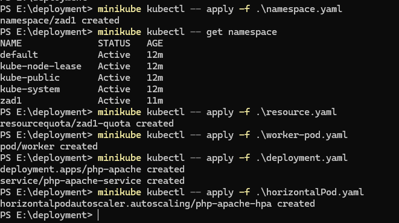
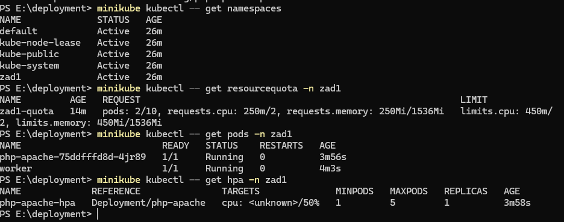
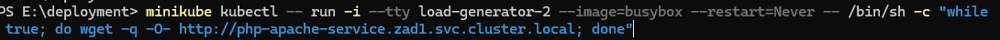
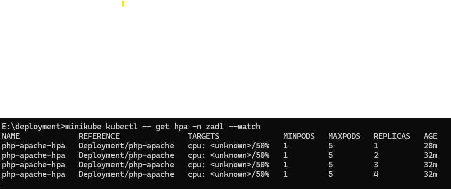

# Kubernetes Lab Task - Full-Stack Cloud Programming

## **Namespace Creation**
Poniżej znajdują się wykorzystane pliki .yaml `zad1`.

### **Namespace**
```yaml
apiVersion: v1
kind: Namespace
metadata:
  name: zad1
```

Command:
```bash
minikube kubectl -- apply -f namespace.yaml
```

---
### **Resource quota**
```yaml
apiVersion: v1
kind: ResourceQuota
metadata:
  name: resource-quota
  namespace: zad1
spec:
  hard:
    pods: "10"
    requests.cpu: "2000m"
    requests.memory: "1.5Gi"
    limits.cpu: "2000m"
    limits.memory: "1.5Gi"
```

Command:
```bash
minikube kubectl -- apply -f quota.yaml
```

---


### **Worker Pod**
```yaml
apiVersion: v1
kind: Pod
metadata:
  name: worker
  namespace: zad1
spec:
  containers:
  - name: nginx-container
    image: nginx
    resources:
      requests:
        memory: "100Mi"
        cpu: "100m"
      limits:
        memory: "200Mi"
        cpu: "200m"
```

Command:
```bash
minikube kubectl -- apply -f worker-pod.yaml
```

---


### **Deployment**
```yaml
apiVersion: apps/v1
kind: Deployment
metadata:
  name: php-apache
  namespace: zad1
spec:
  replicas: 1
  selector:
    matchLabels:
      app: php-apache
  template:
    metadata:
      labels:
        app: php-apache
    spec:
      containers:
      - name: php-apache
        image: php:7.4-apache
        resources:
          requests:
            memory: "150Mi"
            cpu: "150m"
          limits:
            memory: "250Mi"
            cpu: "250m"
```

### **Service**
```yaml
apiVersion: v1
kind: Service
metadata:
  name: php-apache-service
  namespace: zad1
spec:
  selector:
    app: php-apache
  ports:
  - protocol: TCP
    port: 80
    targetPort: 80
```

Command:
```bash
minikube kubectl -- apply -f php-apache-deployment.yaml
minikube kubectl -- apply -f php-apache-service.yaml
```

---


### **HPA**
```yaml
apiVersion: autoscaling/v1
kind: HorizontalPodAutoscaler
metadata:
  name: php-apache-hpa
  namespace: zad1
spec:
  scaleTargetRef:
    apiVersion: apps/v1
    kind: Deployment
    name: php-apache
  minReplicas: 1
  maxReplicas: 5
  targetCPUUtilizationPercentage: 50
```

Command:
```bash
minikube kubectl -- apply -f hpa.yaml
```

---





## **Test autoskalowania**
Obciążenie deploymentu zostało wykonane przez utworzenie nowego poda na obrazie busybox komendą poniżej:

Command:
```bash
kubectl run -i --tty load-generator --image=busybox --restart=Never -- /bin/sh -c "while true; do wget -q -O- http://php-apache-service.zad1.svc.cluster.local; done"
```

Wyniki:


## **Zadanie nieobowiązkowe**
### **1. Czy możliwe jest dokonanie aktualizacji aplikacji (np. wersji obrazu kontenera) gdy
aplikacja jest pod kontrolą autoskalera HPA ? Proszę do odpowiedzi (TAK lub NIE)
dodać link do fragmentu dokumentacji, w którym jest rozstrzygnięta ta kwestia.**
**Odpowiedź**: **Tak**, jest to możliwe. HPA działa niezależnie od deploymentu.

**Źródło**: [Kubernetes - Horizontal Pod Autoscaler](https://kubernetes.io/docs/tasks/run-application/horizontal-pod-autoscale/).

### **2. Parametry Rolling Update**
Aby zagwarantować przynajmniej 2 aktywne pody podczas aktualizacji wymagana jest konfiguracja poniżej:

**Konfiguracja**:
```yaml
strategy:
  type: RollingUpdate
  rollingUpdate:
    maxUnavailable: 0
    maxSurge: 1
```

Zmiany dla HPA:
- zmienić `maxReplicas` na `6` aby uwzględnić dodatkowe pody podczas aktualizacji.

**Uzasadnienie**:
- `maxUnavailable: 0` Zapewnia ciągłość działania aplikacji.
- `maxSurge: 1` Pozwala na uruchomienie dodatkowego poda w czasie aktualizacji.

---

## **Summary**

To zadanie zademonstrowało tworzenie obiektów Kubernetes i zarządzanie nimi przy określonych ograniczeniach, w tym przydziałach zasobów i autoskalowaniu. Zachowanie autoskalera i limity zasobów zostały sprawdzone w testach.
Prześlij opinię

